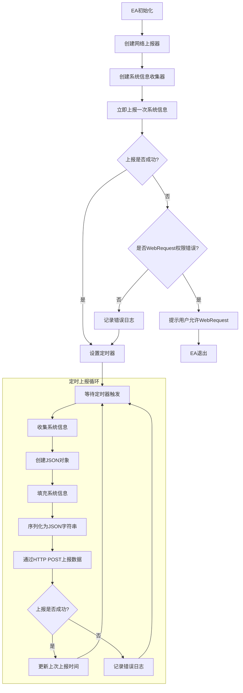

# SystemInfoReporter EA 使用说明

## 功能概述

SystemInfoReporter EA 是一个用于收集和上报 MetaTrader 5 (MT5) 交易平台系统信息的专家顾问。它能够定期收集并上报以下信息：

1. **终端信息**：
   - 终端语言
   - 终端公司名称
   - 终端名称
   - 终端路径
   - 终端数据路径
   - 通用数据路径

2. **系统信息**：
   - CPU名称
   - CPU架构
   - 操作系统版本
   - CPU核心数
   - 物理内存大小

3. **账户信息**：
   - 账户号
   - 经纪商名称
   - 账户交易模式（模拟/竞赛/真实）
   - 账户杠杆
   - 账户货币
   - 账户余额
   - 账户净值

## 工作流程图

## 主要组件

EA由三个主要组件组成：

1. **SystemInfoCollector**：负责收集系统和账户信息
2. **NetworkReporter**：负责将数据通过HTTP POST请求发送到指定服务器
3. **JAson**：简化版JSON处理库，用于数据序列化

## 使用方法

### 安装步骤

1. 将以下文件复制到MT5的相应目录：
   - 将 `SystemInfoReporter.mq5` 和 `SystemInfoReporter.ex5` 复制到 `MQL5/Experts` 目录
   - 将 `Include` 文件夹中的所有文件 (`SystemInfoCollector.mqh`, `NetworkReporter.mqh`, `JAson.mqh`) 复制到 `MQL5/Include` 目录

2. 重启MT5或刷新导航器窗口

### 配置EA

1. 在图表上添加EA：
   - 在导航器窗口中找到 `SystemInfoReporter`
   - 双击或拖拽到任意图表上

2. 配置参数：
   - **api_endpoint**：设置数据上报的服务器API地址（默认为 "https://www.cs123.com/apv/v1/analyesis"）
   - **report_interval**：设置上报间隔，单位为秒（默认为3600秒，即1小时）

### 允许WebRequest

首次运行EA时，需要允许WebRequest功能以便EA能够发送数据到服务器：

1. 当EA提示需要WebRequest权限时，点击"确定"
2. 打开MT5的"工具" -> "选项" -> "专家顾问"选项卡
3. 在"允许WebRequest的URL列表"中添加EA使用的API地址（例如 "https://www.cs123.com"）
4. 点击"确定"保存设置
5. 重新启动EA

### 运行状态确认

EA运行后，可以通过以下方式确认其工作状态：

1. 查看"专家"选项卡中的日志信息：
   - 成功上报时会显示："系统信息已上报: [JSON数据]"
   - 上报失败时会显示："系统信息上报失败"

2. 检查服务器是否收到数据（需要服务器端支持）

## 注意事项

1. EA需要互联网连接才能正常工作
2. 必须允许WebRequest功能并添加正确的URL
3. EA会在初始化时立即上报一次数据，之后按设定的间隔定期上报
4. EA不会影响交易操作，可以与其他EA同时使用
5. 如需修改上报的数据内容，请编辑 `SystemInfoCollector.mqh` 文件中的 `CollectSystemInfo` 方法

## 故障排除

1. **EA无法上报数据**：
   - 检查网络连接
   - 确认WebRequest权限设置正确
   - 验证API端点地址是否有效

2. **EA初始化失败**：
   - 检查是否正确安装了所有必要文件
   - 查看日志中的错误信息

3. **数据格式错误**：
   - 检查服务器是否期望不同的数据格式
   - 可能需要修改 `JAson.mqh` 中的序列化方法 